# Домашнее задание к занятию «Prometheus. Часть 2». Потапчук Сергей.

Это задание для самостоятельной отработки навыков и не предполагает обратной связи от преподавателя. Его выполнение не влияет на завершение модуля. Но мы рекомендуем его выполнить, чтобы закрепить полученные знания.

### Цели задания
1. Научитья настраивать оповещения в Prometheus
2. Научиться устанавливать Alertmanager и интегрировать его с Prometheus
3. Научиться активировать экспортёр метрик в Docker и подключать его к Prometheus.
4. Научиться создавать дашборд Grafana

### Чеклист готовности к домашнему заданию
- [ ] Просмотрите в личном кабинете занятие "Система мониторинга Prometheus. Часть 2" 

### Инструкция по выполнению домашнего задания

1. Сделайте fork [репозитория c шаблоном решения](https://github.com/netology-code/sys-pattern-homework) к себе в Github и переименуйте его по названию или номеру занятия, например, https://github.com/имя-вашего-репозитория/gitlab-hw или https://github.com/имя-вашего-репозитория/8-03-hw).
2. Выполните клонирование этого репозитория к себе на ПК с помощью команды `git clone`.
3. Выполните домашнее задание и заполните у себя локально этот файл README.md:
   - впишите вверху название занятия и ваши фамилию и имя;
   - в каждом задании добавьте решение в требуемом виде: текст/код/скриншоты/ссылка;
   - для корректного добавления скриншотов воспользуйтесь инструкцией [«Как вставить скриншот в шаблон с решением»](https://github.com/netology-code/sys-pattern-homework/blob/main/screen-instruction.md);
   - при оформлении используйте возможности языка разметки md. Коротко об этом можно посмотреть в [инструкции по MarkDown](https://github.com/netology-code/sys-pattern-homework/blob/main/md-instruction.md).
4. После завершения работы над домашним заданием сделайте коммит (`git commit -m "comment"`) и отправьте его на Github (`git push origin`).
5. В личном кабинете прикрепите и отправьте ссылку на решение в виде md-файла в вашем Github.
6. Любые вопросы задавайте в чате учебной группы и/или в разделе «Вопросы по заданию» в личном кабинете.

---

### Задание 1
Создайте файл с правилом оповещения, как в лекции, и добавьте его в конфиг Prometheus.

### Требования к результату
- [ ] Погасите node exporter, стоящий на мониторинге, и прикрепите скриншот раздела оповещений Prometheus, где оповещение будет в статусе Pending

### Решение

Создал файл [alert_rules.yml](alert_rules.yml) с текстом из презентации.

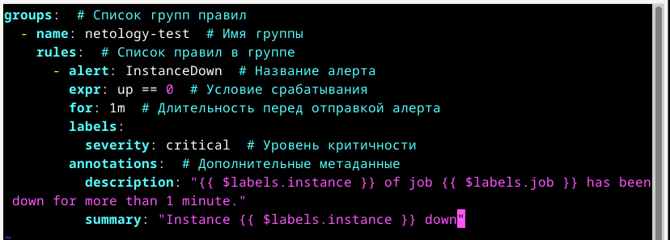

Прописал его в конфигурации Prometheus (/etc/prometheus/prometheus.yml)

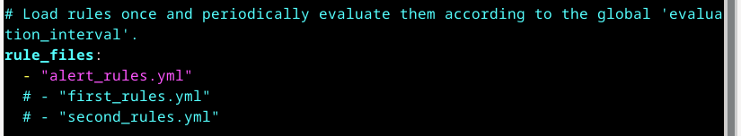

Перезапустил сервис и проверил его статус

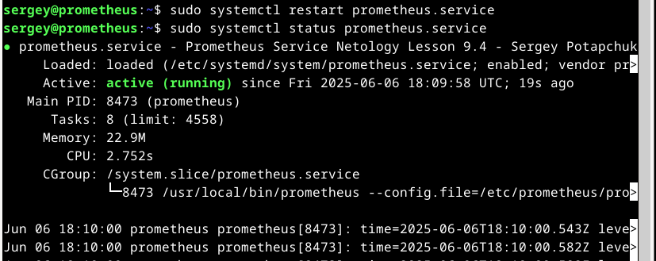

Проверил правило в Prometheus

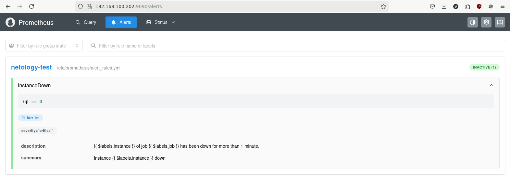

Остановил сервис node_exporter

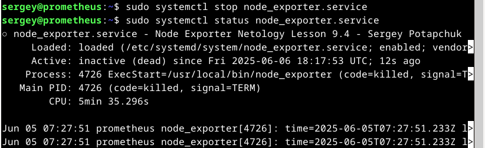

Проверил сработку в Prometheus

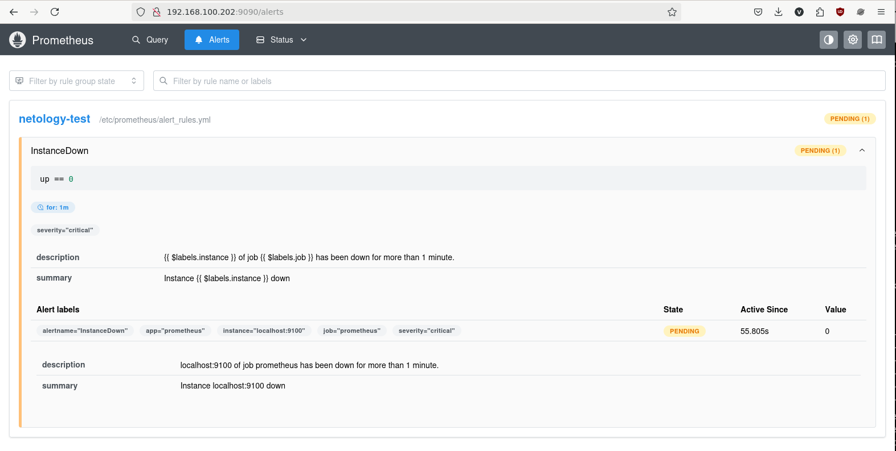

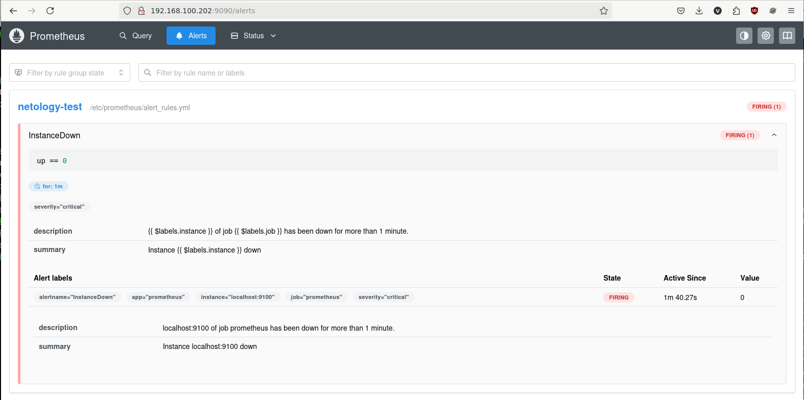

---

### Задание 2
Установите Alertmanager и интегрируйте его с Prometheus.

### Требования к результату
- [ ] Прикрепите скриншот Alerts из Prometheus, где правило оповещения будет в статусе Fireing, и скриншот из Alertmanager, где будет видно действующее правило оповещения

### Решение

```
wget https://github.com/prometheus/alertmanager/releases/download/v0.28.1/alertmanager-0.28.1.linux-amd64.tar.gz
sudo cp alertmanager-0.28.1.linux-amd64/{alertmanager,amtool} /usr/local/bin/
sudo cp alertmanager-0.28.1.linux-amd64/alertmanager.yml /etc/prometheus/
sudo chown -R prometheus:prometheus /etc/prometheus/
```

Создал файл /etc/systemd/system/[alertmanager.service](alertmanager.service) примерно как в презентации

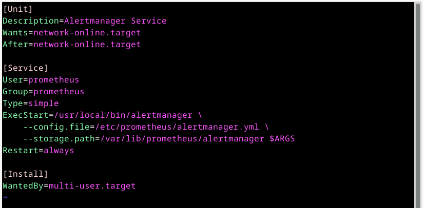

Изменил /etc/prometheus/[alertmanager.yml](alertmanager.yml) как в презентации

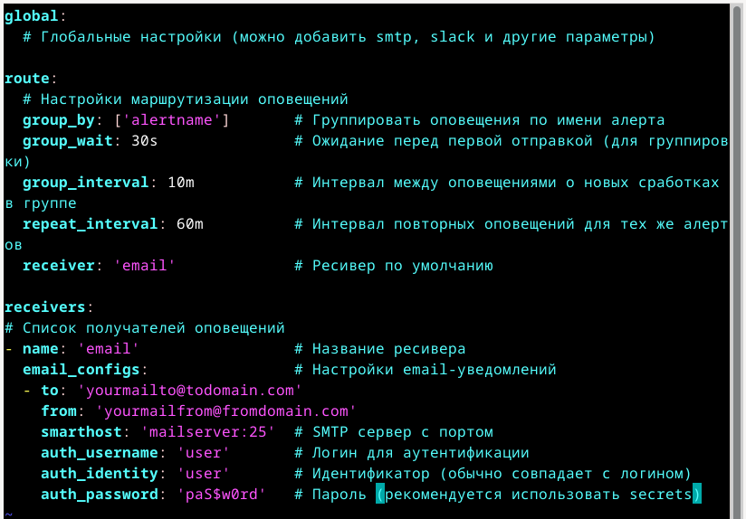

```
sudo systemctl enable --now alertmanager.service
sudo systemctl status alertmanager.service
```

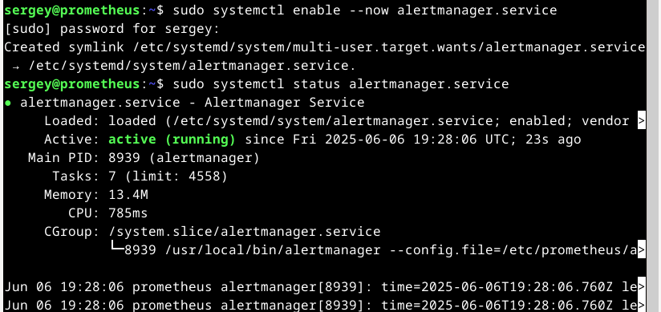

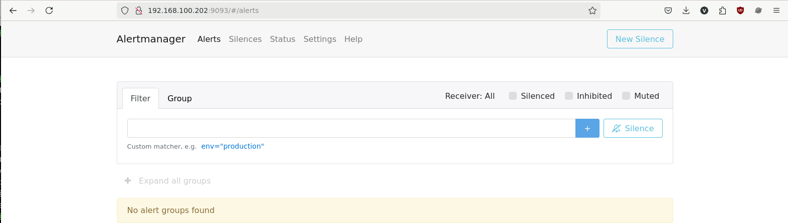

Изменил конфигурацию Prometheus (/etc/prometheus/prometheus.yml)

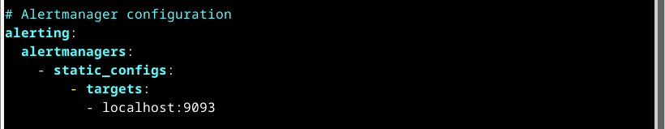

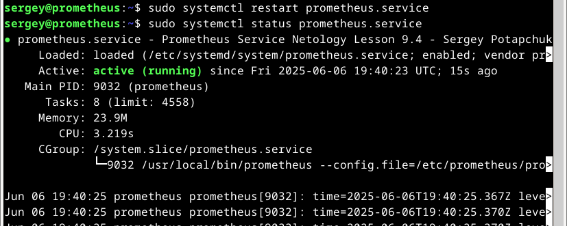

Остановил node_exporter

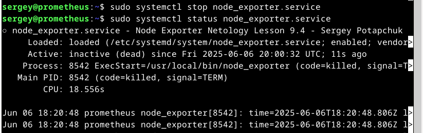

Подождал когда правило перейдет в статус FIRING


Проверил, что сработал Alertmanager


---

### Задание 3

Активируйте экспортёр метрик в Docker и подключите его к Prometheus.

### Требования к результату
- [ ] приложите скриншот браузера с открытым эндпоинтом, а также скриншот списка таргетов из интерфейса Prometheus.*

### Решение

---

### Задание 4* (со звездочкой)

Создайте свой дашборд Grafana с различными метриками Docker и сервера, на котором он стоит.

### Решение

